# Commands Reference

Per-command reference for every slash command in the `.claude/` system. Thirty-nine commands as of today, grouped into four categories matching `CLAUDE.md:49-83`: **Setup**, **Build Loop**, **Supporting**, **Review**.

This is the reference. For the conceptual framing — what a command *is*, how it relates to agents and skills, the orchestration pattern every command follows — read [`../concepts/commands.md`](../concepts/commands.md). For the rendered inventory across the whole system, see [`./system-map.md`](./system-map.md).

Each entry below gives the command's purpose, the agent(s) it dispatches, and — where available — a mermaid flowchart showing the decision shape. The commands that don't have diagrams (`/status`, `/investigate`, `/remember`, `/review:timeline`, `/create:component`) are linear enough to describe in a paragraph.

---

## Pick a command by intent

| I want to... | Use |
|---|---|
| Drop this template into an existing codebase | [`/onboard`](#onboard) |
| Start a brand-new project from scratch | [`/brainstorm`](#brainstorm) |
| Validate an assumption before writing docs | [`/research`](#research) |
| Gather requirements interactively | [`/interview`](#interview) |
| Write the strategic vision | [`/create:project-brief`](#createproject-brief) |
| Write the PRD | [`/create:project-requirements`](#createproject-requirements) |
| Write the architecture | [`/create:project-architecture`](#createproject-architecture) |
| Write UX spec, wireframes, themes, mock | [`/create:project-design`](#createproject-design) |
| Break requirements into epics and stories | [`/create:project-epics`](#createproject-epics) |
| Build the master TODO index | [`/create:project-todo`](#createproject-todo) |
| Build per-epic TODO checklists | [`/create:project-epics-todo`](#createproject-epics-todo) |
| Add a new feature module to an existing project | [`/create:module`](#createmodule) |
| Add a new agent, command, or skill | [`/create:component`](#createcomponent) |
| Resume a session | [`/prime`](#prime) |
| Plan a task before implementing | [`/todo`](#todo) |
| Implement one task end-to-end | [`/do`](#do) |
| Burn down a whole checklist with parallel agents | [`/run-todo`](#run-todo) |
| Run manual / E2E tests with screenshots | [`/run-tests`](#run-tests) |
| Save session context for next time | [`/end`](#end) |
| Check project progress | [`/status`](#status) |
| Debug a bug with root-cause analysis first | [`/investigate`](#investigate) |
| Capture a conversational insight to memory | [`/remember`](#remember) |
| Move plan files to dated folders | [`/organize`](#organize) |
| Get a second opinion on code quality | [`/review:code-review`](#reviewcode-review) |
| Run a security audit | [`/review:security`](#reviewsecurity) |
| Generate tests for existing code | [`/review:qa`](#reviewqa) |
| Gate-check planning docs before impl | [`/review:check-readiness`](#reviewcheck-readiness) |
| Detect doc drift | [`/review:check-sync`](#reviewcheck-sync) |
| Fix the drift `/review:check-sync` found | [`/review:update-docs`](#reviewupdate-docs) |
| Audit the `.claude/` system itself | [`/review:check-templates`](#reviewcheck-templates) |
| Find the critical path across the backlog | [`/review:optimize-backlog`](#reviewoptimize-backlog) |
| Run an epic retrospective | [`/retro`](#retro) |
| Write release notes | [`/review:changelog`](#reviewchangelog) |
| Customize this template for your tech stack | [`/review:specialize`](#reviewspecialize) |
| Re-align agents mid-project | [`/review:optimize-agents`](#reviewoptimize-agents) |
| Give agents names and personalities | [`/review:personalize`](#reviewpersonalize) |
| Health-check the memory system | [`/review:memory-health`](#reviewmemory-health) |
| Promote proven memories to templates or skills | [`/review:promote-memories`](#reviewpromote-memories) |
| Regenerate the weekly commit timeline | [`/review:timeline`](#reviewtimeline) |

---

## Contents

- [Setup](#setup) — 13 commands for project initialization
- [Build Loop](#build-loop) — 6 commands for the daily development cycle
- [Supporting](#supporting) — 7 utility commands
- [Review](#review) — 16 commands for quality, governance, and optimization
- [Appendix A: Command dependency flow](#appendix-a-command-dependency-flow)
- [Appendix B: Agent usage summary](#appendix-b-agent-usage-summary)
- [Appendix C: Commit behavior summary](#appendix-c-commit-behavior-summary)
- [Appendix D: Color legend for diagrams](#appendix-d-color-legend-for-diagrams)

---

# Setup

Thirteen commands for project initialization — from brainstorm through per-epic TODO generation, plus module scaffolding, component creation, the `/create:new-project` master orchestrator, and the `/onboard` brownfield bootstrapper. Run them in roughly this order the first time you drop the template into a repo. The `/create:project-*` chain enforces hard gates. Use `/onboard` instead of `/create:new-project` when source code already exists.

## /brainstorm

Guided ideation session. Writes `docs/product/brainstorm.md` (always) plus topic-driven satellites as warranted (e.g., `feature-ideas.md`). Dispatches `product-strategist` with the `project-planning` skill.

```mermaid
flowchart TD
    START(["/brainstorm"]) --> CHK{docs/product/brainstorm.md\nexists?}
    CHK -->|Yes| ASK_MODE{Ask user:\nUpdate or Fresh?}
    CHK -->|No| CHK_INPUT{INPUT\nprovided?}
    ASK_MODE -->|Update| CHK_INPUT
    ASK_MODE -->|Fresh| CHK_INPUT

    CHK_INPUT -->|Yes| CONTEXT[Use INPUT as\nproblem statement]
    CHK_INPUT -->|No| INTERVIEW[Interview: 3 rounds\nvia AskUserQuestion]

    INTERVIEW -->|Round 1| Q1[Problem discovery:\nproblem statement,\naffected users]
    Q1 -->|Round 2| Q2[Context:\nexisting solutions,\nsuccess criteria]
    Q2 -->|Round 3| Q3[Constraints:\nhard constraints,\nminimal viable version]
    Q3 --> CONTEXT

    CONTEXT --> GATHER[Gather context:\nREADME, package.json,\nWebSearch if needed]

    GATHER --> DELEGATE["Agent: product-strategist\n(auto-loads project-planning skill)"]
    DELEGATE --> AGENT_WORK["Frame problem\nExplore 3-5 directions\nEvaluate: Feasibility/Impact/Effort/Risk\nCreate evaluation matrix\nRecommend direction"]

    AGENT_WORK --> FEATURE{docs/work/todo/feature-ideas.md\nexists with content?}
    FEATURE -->|No/Template| CREATE_FI[Create from template]
    FEATURE -->|Yes| APPEND_FI[Append new ideas]
    CREATE_FI --> POPULATE[Populate ideas:\ncategorize, prioritize,\nstatus=Idea, source=brainstorm]
    APPEND_FI --> POPULATE

    POPULATE --> COMMIT["Commit:\ndocs/product/brainstorm.md\ndocs/work/todo/feature-ideas.md"]
    COMMIT --> REPORT(["Report:\nOutput file, feature count,\ncommit hash"])

    style START fill:#4a9eff,color:#fff
    style DELEGATE fill:#f5a623,color:#fff
    style COMMIT fill:#2ecc71,color:#fff
    style REPORT fill:#888,color:#fff
```

---

## /research

Validate market, technical, domain, or competitive assumptions. Writes `docs/product/research.md` plus raw outputs under `docs/.output/findings/research/{YYYY-MM-DD}/`. Dispatches `product-strategist` (single or parallel Tasks).

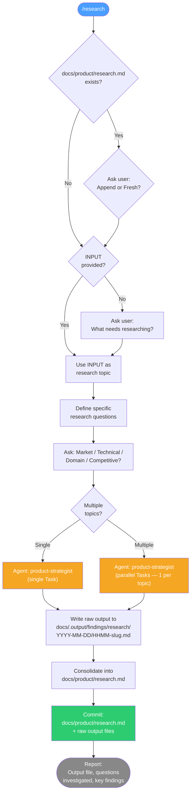

---

## /interview

Interactive Q&A to gather requirements, preferences, or decisions. Chat-only — writes no files, makes no commit. Runs up to 3 rounds of `AskUserQuestion`.

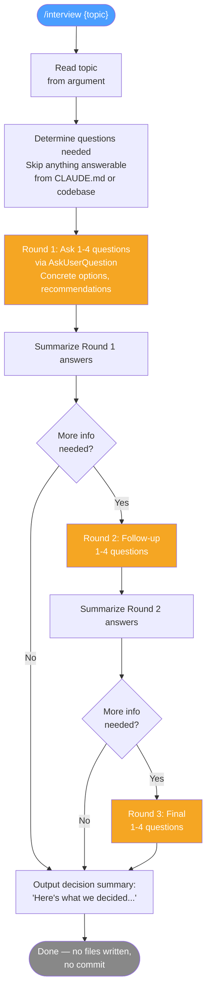

---

## /create:project-brief

Strategic vision doc. Writes `docs/product/brief.md`. Dispatches `product-strategist` with the `project-planning` skill. Runs in Context Mode (if brainstorm/research exists) or Interview Mode.

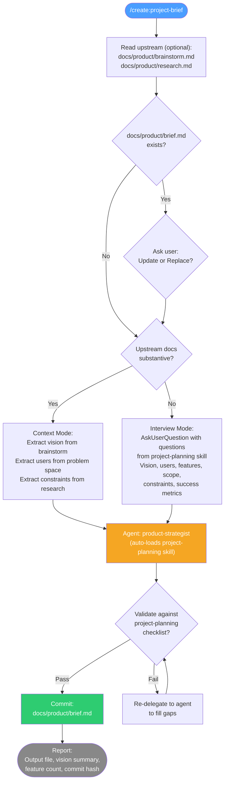

---

## /create:project-requirements

PRD with FRs, NFRs, MoSCoW priorities. Writes `docs/product/requirements.md`. Dispatches `product-strategist` with the `project-planning` skill. **Hard gate:** needs at least one of `product/brief.md`, `product/brainstorm.md`, or `product/research.md` (bypass with `--yolo`).

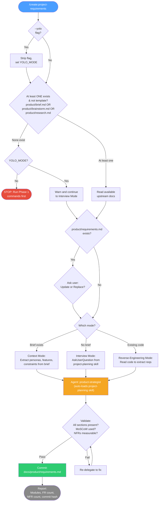

---

## /create:project-architecture

Tech stack, ADRs, system design. Writes `docs/architecture/overview.md`. Dispatches `architect` with the `architecture` skill. **Hard gate:** needs `product/requirements.md`.

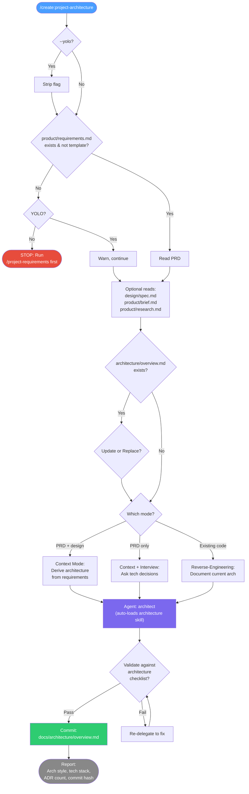

---

## /create:project-design

UX spec, wireframes, themes, mock layout. Writes 5 files under `docs/design/` (spec, wireframes, light theme, dark theme, mock HTML) plus syncs the `brand-guidelines` skill. Dispatches `ux-designer` (with parallel Tasks for wireframes + themes). **Hard gate:** needs `product/requirements.md`.

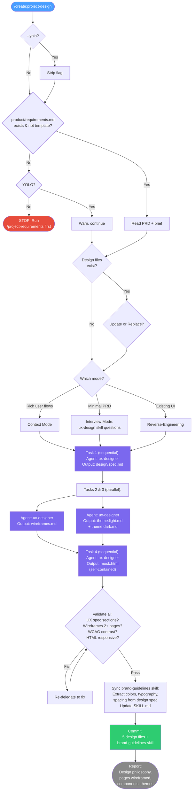

---

## /create:project-epics

Break requirements into phases → epics → stories with acceptance criteria. Writes `docs/work/backlog.md`. Dispatches `project-planner` with the `project-planning` skill. **Hard gate:** needs both `product/requirements.md` and `architecture/overview.md`.

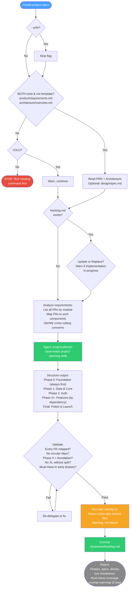

---

## /create:project-todo

Master implementation index. Writes `docs/TODO_{ProjectName}.md` with phase map, epic index, cross-epic deps, optimization summary, phase gates. Dispatches `project-planner`. **Hard gate:** needs `docs/work/backlog.md`.

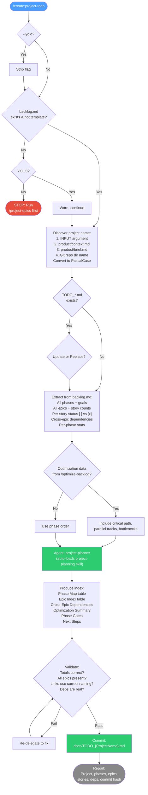

---

## /create:project-epics-todo

Per-epic story checklists. Writes one or more `docs/work/todo/TODO_epic{NN}_{slug}.md` files. Dispatches `project-planner` (single or parallel per epic). **Hard gate:** needs `docs/work/backlog.md`.

```mermaid
flowchart TD
    START(["/create:project-epics-todo"]) --> YOLO{--yolo?}
    YOLO -->|Yes| STRIP[Strip flag]
    YOLO -->|No| GATE
    STRIP --> GATE

    GATE{backlog.md\nexists & not template?}
    GATE -->|No| YOLO_CHK{YOLO?}
    YOLO_CHK -->|No| STOP(["STOP: Run\n/project-epics first"])
    YOLO_CHK -->|Yes| WARN[Warn, continue]
    GATE -->|Yes| INPUT
    WARN --> INPUT

    INPUT{INPUT type?}
    INPUT -->|Number e.g. "3"| FIND[Find Epic 3\nin backlog.md]
    INPUT -->|"all"| ALL["Warn: generates N files\nConfirm with user"]
    INPUT -->|None| LIST["Show epic list\nHighlight those without\nchecklists yet"]

    FIND --> CHK_EXIST
    ALL --> CHK_EXIST
    LIST --> CHK_EXIST

    CHK_EXIST{Checklist\nalready exists?}
    CHK_EXIST -->|Yes| ASK{Update or Replace?}
    CHK_EXIST -->|No| EXTRACT
    ASK --> EXTRACT

    EXTRACT["Extract from backlog.md:\nEpic metadata\nAll stories with AC\nCross-epic deps\nOptimization data"]

    EXTRACT --> DELEGATE["Agent: project-planner\n(auto-loads project-planning skill)\nSingle or parallel per epic"]

    DELEGATE --> SECTIONS["Produce per epic:\nExecutive Summary\nOptimization Summary\nExecution Log\nKey Decisions\nStories (dependency order)\n  - AC, Tasks, Deps\nValidation checklist\nWork Doc References"]

    SECTIONS --> VALIDATE{Validate:\nAll stories present?\nDependency order?\nAC matches backlog?\nNo code blocks?\nAll sections present?}
    VALIDATE -->|Fail| FIX[Re-delegate to fix]
    FIX --> VALIDATE
    VALIDATE -->|Pass| COMMIT["Commit:\nTODO_epicNN_slug.md\n(one or more)"]
    COMMIT --> REPORT(["Report:\nEpic, phase, stories,\ncritical path, commit hash"])

    style START fill:#4a9eff,color:#fff
    style STOP fill:#e74c3c,color:#fff
    style DELEGATE fill:#2ecc71,color:#fff
    style COMMIT fill:#2ecc71,color:#fff
    style REPORT fill:#888,color:#fff
```

---

## /create:component

Scaffold a new agent, command, or skill following established conventions. Writes the new file under `.claude/agents/`, `.claude/commands/`, or `.claude/skills/{slug}/SKILL.md` depending on component type. Flow: ask for component type → ask for name + purpose → generate from template → commit.

No mermaid — the flow is linear and mostly interactive. The component templates live in `.claude/templates/components/` and are filled via placeholder substitution.

**Output:** one of `.claude/agents/{name}.md`, `.claude/commands/{name}.md`, or `.claude/skills/{name}/SKILL.md`. Commits the created file with message `feat: add {type} — {name}`.

---

## /create:new-project

Master orchestrator that walks a fresh clone from zero to implementation-ready. Scaffolds `docs/` from `.claude/templates/`, runs a 3-round interview (elevator pitch → tech & scope → constraints), classifies the project as simple/medium/complex, then chains the planning pipeline (`/create:project-brief` → `/create:project-requirements` → optional `/create:project-design` → `/create:project-architecture` → `/create:project-epics` → `/review:check-readiness`), specializes the generic agents for the new stack via `/review:specialize --fix`, and writes `docs/product/context.md` as the quick-reference. Intended as the FIRST command an adopter runs after cloning the template.

The fresh-project check at Step 2 refuses to run if any non-template planning doc already exists, unless `--yolo` is passed. Each sub-command commits its own work; the wrap-up commit at Step 10 stages only `product/context.md` and the persisted interview scratch file at `docs/.output/.state/work/{date}/new-project-interview.md`.

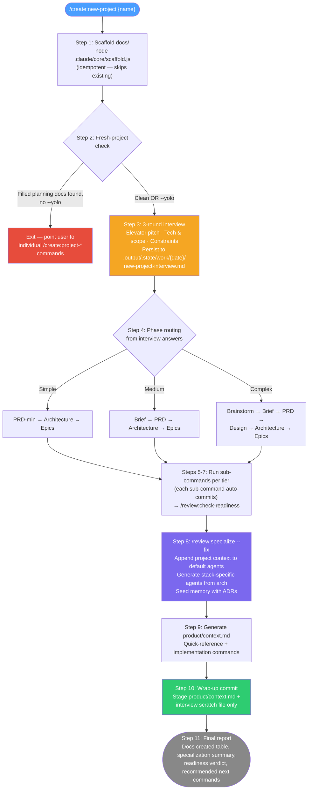

**Output:** `docs/product/context.md` + the full planning chain (`product/brief.md` per tier, `product/requirements.md`, `design/spec.md` per UI flag, `architecture/overview.md`, `work/backlog.md`) + specialized `.claude/agents/*.md`. Each sub-command commits its own output; the orchestrator's wrap-up commit captures only the project-context file and the interview scratch.

---

## /onboard

Brownfield bootstrapper — reverse-engineers the doc chain from an existing codebase. The brownfield analog of `/create:new-project`: no templates, no vision interview, no blank-slate assumptions. Reads the code first, asks only 2–3 questions code cannot answer, then writes `docs/architecture/overview.md` and `docs/product/context.md` from reality. Chains `/review:specialize` once the architecture doc exists.

**Hard-gate posture:** `/onboard` has no doc prerequisites — it is the entry point. It refuses only when no source code is detectable (then points at `/create:new-project`).

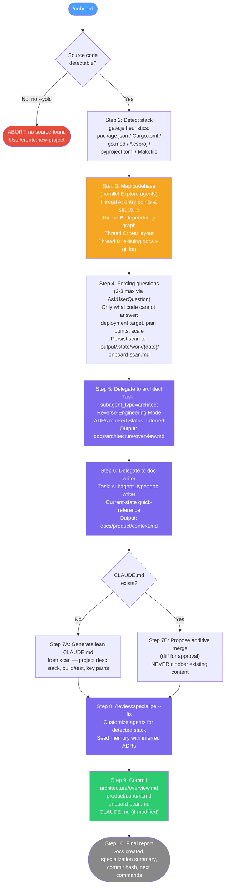

**Output:** `docs/architecture/overview.md` + `docs/product/context.md` + `docs/.output/.state/work/{date}/onboard-scan.md` + optional `CLAUDE.md` update + specialized `.claude/agents/*.md`. One commit covers all outputs. No brief is generated — run `/create:project-brief` separately when ready to capture vision.

---

# Build Loop

Six commands used dozens of times per session. Every session starts with `/prime` and ends with `/end`. Between them, `/do` and `/run-todo` are the workhorses.

## /prime

Cold-start a session. Resolves the latest per-branch handoff via `handoff-path.js latest` (under `docs/.output/handoffs/`), reads it alongside `git log --oneline -20` and `git status --short` in parallel; compares handoff against git reality; reports recent work + next actions. No commit.

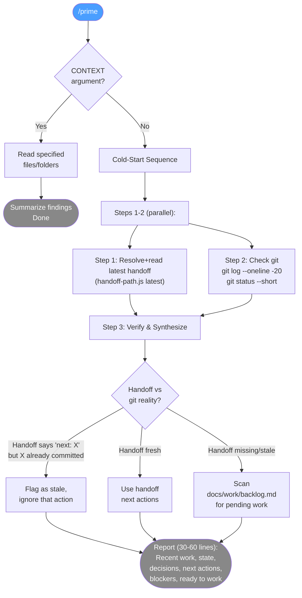

---

## /todo

Create an execution-ready checklist with AC, wave plan, self-review. Writes `docs/work/todo/TODO_{slug}.md` (or `docs/modules/{module}/TODO_{module}.md`). Dispatches `project-planner`; large TODOs get a `code-reviewer` pass. Research artifacts land under `docs/.output/.state/work/{date}/`. No commit (chat-only).

```mermaid
flowchart TD
    START(["/todo"]) --> INPUT{INPUT type?}
    INPUT -->|File path| READ_FILE[Read file]
    INPUT -->|Module name| READ_MOD["Read\ndocs/modules/{name}/brief.md"]
    INPUT -->|Description| USE_DESC[Use as-is]
    INPUT -->|None| INFER["Infer from:\nconversation → handoff →\ngit log → ask user"]

    READ_FILE --> GATHER
    READ_MOD --> GATHER
    USE_DESC --> GATHER
    INFER --> GATHER

    GATHER["Gather context (parallel):\nCLAUDE.md\narchitecture/overview.md\nModule briefs"]

    GATHER --> ESTIMATE{Estimate\nstory count?}

    ESTIMATE -->|"Small (1-4)"| ASSEMBLE["Skip research agents\nDirect to assembly"]
    ESTIMATE -->|"Medium (5-7)"| MED["1 Research Agent:\nCodebase + Dependencies\nFile paths, tests, dep graph,\nwave groupings"]
    ESTIMATE -->|"Large (8+)"| LARGE["2 Research Agents (parallel):\n1. Codebase + Dependencies\n2. Pattern + Convention Scanner"]

    MED --> RESEARCH_OUT["Write research to\n.output/work/date/\ntodo-research-*.md"]
    LARGE --> RESEARCH_OUT

    ASSEMBLE --> PLANNER
    RESEARCH_OUT --> PLANNER

    PLANNER["Agent: project-planner\nAssemble TODO with:\nExecutive Summary\nDependency Graph (ASCII)\nPhases → Epics → Stories\n  (AC, estimates, files)\nStory Index\nParallelization Plan"]

    PLANNER --> REVIEW{Large TODO\n(8+ stories)?}
    REVIEW -->|Yes| CODE_REV["Agent: code-reviewer\nQA coverage check\nAC completeness\nWave ordering\nDoes NOT edit TODO"]
    REVIEW -->|No| SYNTH

    CODE_REV --> SYNTH["Main agent synthesizes:\nRead review findings\nDecide what to accept\nApply to TODO"]

    SYNTH --> REPORT(["Report:\nTODO path, story count,\nresearch files location,\nstory breakdown table"])

    style START fill:#4a9eff,color:#fff
    style MED fill:#f5a623,color:#fff
    style LARGE fill:#f5a623,color:#fff
    style PLANNER fill:#2ecc71,color:#fff
    style CODE_REV fill:#e74c3c,color:#fff
    style REPORT fill:#888,color:#fff
```

---

## /do

Execute one task end-to-end: plan-first → TDD → size-aware implementation (Main Agent direct or Sonnet delegate) → build/test gate → AC verification → commit → handoff regeneration. Every `/do` writes a per-session handoff under `docs/.output/handoffs/` (resolved via `handoff-path.js`) so sessions are resumable mid-task. Writes plan file to `docs/.output/plans/{YYYY-MM-DD}-do-{slug}.md`.

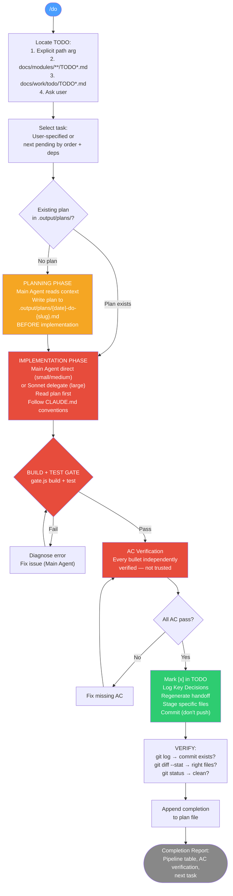

---

## /run-todo

Execute an entire TODO checklist with wave-based parallel agents, per-wave AC gates, and automatic commits. Three phases: planning (build execution plan, group into waves by file-ownership), execution (parallel dev + QA pairs per story, wave gate, code-reviewer pass for M/L stories), post-execution (final gate, organize files). Commits per wave.

```mermaid
flowchart TD
    START(["/run-todo"]) --> LOCATE["Locate TODO:\nExplicit path or search\nIf none → run /todo to create"]

    LOCATE --> PREFLIGHT["Pre-flight:\ngit status\nRun build + test (baseline)\nIf broken → STOP"]
    PREFLIGHT --> PLAN_CHK{Plan exists?}

    PLAN_CHK -->|No| PLAN["PHASE 1: PLANNING\nGather research (or reuse /todo output)\nBuild execution plan:\n  Story → Agent → Files → AC\nGroup into WAVES\n  (zero file overlap per wave)\nCreate TaskList\nWrite .output/plans/{slug}.md"]
    PLAN_CHK -->|Yes| EXEC
    PLAN --> EXEC

    EXEC["PHASE 2: EXECUTION\nFor each wave..."]

    EXEC --> PRE_STORY["Pre-story check:\ngit status\nVerify [ ] still pending"]

    PRE_STORY --> DISPATCH["Dispatch per story\n(parallel pairs in single message):"]
    DISPATCH --> DEV["Dev Agent:\nImplement story\nDO NOT TOUCH\nother stories' files"]
    DISPATCH --> QA["QA Agent:\nWrite tests\nSame interface contract\n(skip if XS/deletion)"]

    DEV --> COLLECT
    QA --> COLLECT

    COLLECT["Collect results\nFix misalignments:\n1. Signature mismatch\n2. Missing test setup\n3. Guard test drift\n4. Missing test IDs\n5. Wrong file touched"]

    COLLECT --> WAVE_GATE{"Build + Test Gate"}
    WAVE_GATE -->|Fail| FIX_LOOP["Diagnose & fix\nLoop back"]
    FIX_LOOP --> WAVE_GATE
    WAVE_GATE -->|Pass| AC_CHK{"AC verification\nAll criteria met?"}
    AC_CHK -->|No| TARGETED[Targeted fix instructions]
    TARGETED --> AC_CHK
    AC_CHK -->|Yes| CR{M/L stories?}

    CR -->|Yes| CODE_REV["Agent: code-reviewer\nReview wave changes"]
    CR -->|No| COMMIT_WAVE

    CODE_REV --> COMMIT_WAVE["Mark stories [x]\nStage files\nCommit wave\nVerify commit"]

    COMMIT_WAVE --> NEXT{More waves?}
    NEXT -->|Yes| EXEC
    NEXT -->|No| POST

    POST["PHASE 3: POST-EXECUTION\nFinal build + test gate\nVerify all stories [x]\nOrganize files"]
    POST --> DONE(["Done:\nAll stories complete"])

    style START fill:#4a9eff,color:#fff
    style PLAN fill:#f5a623,color:#fff
    style DEV fill:#e74c3c,color:#fff
    style QA fill:#7b68ee,color:#fff
    style CODE_REV fill:#f5a623,color:#fff
    style COMMIT_WAVE fill:#2ecc71,color:#fff
    style DONE fill:#888,color:#fff
```

---

## /run-tests

Execute a manual/E2E testing checklist using parallel agents with screenshots, verification, and automated TODO updates. Up to 4 parallel agents per wave; agent type chosen per checkpoint (code/DB → `general-purpose`, page load / form fill → `playwright`, complex UI → chrome-mcp). Writes a final report to `docs/screenshots/{date}/TEST-REPORT.md` plus screenshot dirs. No commit (docs-only).

```mermaid
flowchart TD
    START(["/run-tests"]) --> LOCATE["Locate testing checklist:\n1. Explicit path\n2. docs/**/TODO*Test*.md\n3. docs/**/*testing*.md\n4. Ask user"]

    LOCATE --> PREFLIGHT["Pre-flight:\nVerify app running (curl)\nRun non-browser checks first\nCreate screenshot dirs\nMark non-browser cats [x]\nCreate TaskList"]

    PREFLIGHT --> APP_CHK{App running?}
    APP_CHK -->|No| STOP(["STOP:\nApp not accessible"])
    APP_CHK -->|Yes| SELECTORS

    SELECTORS["Discover test selectors:\nAgent: Explore\nFind all data-testid\nattributes in source"]

    SELECTORS --> CLASSIFY["Classify checkpoints:\nCode/DB → general-purpose\nPage load → playwright-cli\nForm fill → playwright-cli\nComplex UI → chrome-mcp\nMixed → general-purpose + chrome"]

    CLASSIFY --> WAVES["Wave Execution\n(up to 4 parallel agents per wave)"]

    WAVES --> AGENT["Per wave:\nAgent: playwright-cli\nor general-purpose\nAuth method specified\nScreenshot at every step\nFast-fail if BLOCKED"]

    AGENT --> UPDATE["Update TODO checkmarks:\n[x] = passed\n[!] = blocked/failed\n[S] = skipped\nWith annotations"]

    UPDATE --> NEXT{More waves?}
    NEXT -->|Yes| WAVES
    NEXT -->|No| CLEANUP

    CLEANUP["Cleanup:\nDelete test data\nReset modified configs"]

    CLEANUP --> FINAL["Write final report:\ndocs/screenshots/date/\nTEST-REPORT.md\nPass rate, bugs found,\nblocked root causes"]

    FINAL --> RETRO["Retrospective (mandatory):\nWhich agents worked?\nWhat interaction types failed?\nUpdate agent selection table\nLog session learnings"]

    RETRO --> DONE(["Done:\nNo commit — documentation only"])

    style START fill:#4a9eff,color:#fff
    style STOP fill:#e74c3c,color:#fff
    style SELECTORS fill:#f5a623,color:#fff
    style AGENT fill:#7b68ee,color:#fff
    style DONE fill:#888,color:#fff
```

---

## /end

Save session context for the next conversation. Reads plans for unfinished items, runs `organize.cjs`, refreshes `work/timeline.md` if stale, gathers live git state, writes this session's handoff (`docs/.output/handoffs/{stamp}-{caller}-{branch}.md`, via the session-handoff skill), and commits the handoff.

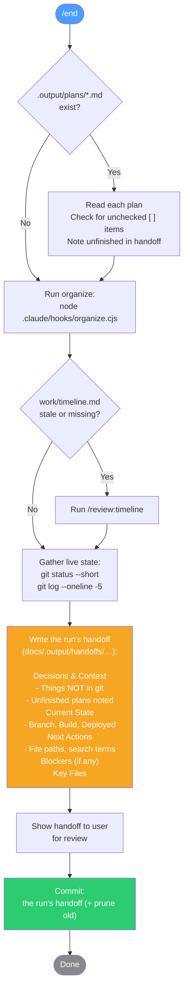

> **`/recap` was removed** in v3. Memory now auto-compounds via the `memory-capture.cjs` Stop hook: daily-log capture (auto via Stop hook) → optional `memory-extractor.js extract` (manual Haiku, brownfield only) → `memory-manager.js create`. See [`../concepts/memory.md`](../concepts/memory.md).

---

# Supporting

Seven utility commands for progress-checking, module scaffolding, cleanup, debugging, memory capture, and the post-MVP signal→backlog lifecycle (`/listen` → `/triage`).

## /status

Parse every TODO file in `docs/` (master index + per-epic + per-module), compute phase/epic/story completion percentages, and generate an HTML dashboard at `docs/.output/.state/status.html`. Chat-only summary also printed. No commit.

Flow: find TODO files → parse status markers (`[ ]`, `[>]`, `[x]`, `[~]`, `[!]`) → roll up counts → render HTML via `.claude/core/status.js` → report critical path, blocked stories, next pending work.

**Use when:** you want a quick read on overall progress without opening each TODO file individually.

---

## /create:module

Add a new feature area to an existing project. Runs a 5-phase flow: context gathering → stakeholder brainstorm (4 parallel agents) → decision → documentation → TODO generation. Writes `docs/modules/{module}/brief.md` plus `docs/work/todo/TODO_{ModuleName}.md`; may update PRD or architecture if scope warrants.

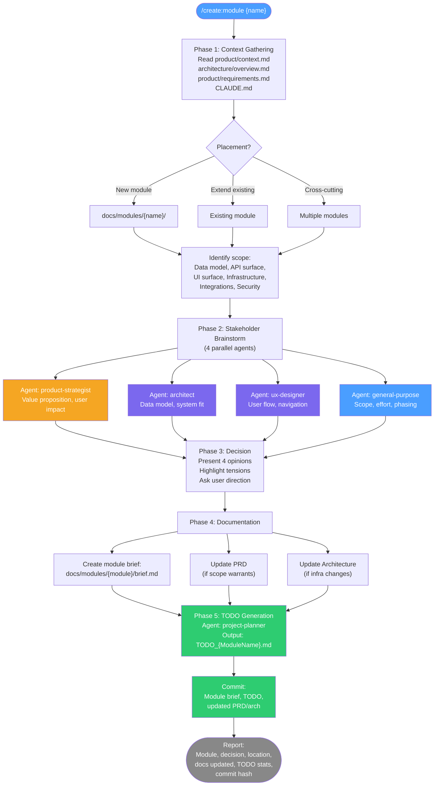

---

## /organize

Move plan files and screenshots into dated folders. Runs `node .claude/hooks/organize.cjs`. Plans go to `docs/.output/plans/{date}/`; screenshots go to `docs/.output/.state/screenshots/{date}/{task}/`. No commit.

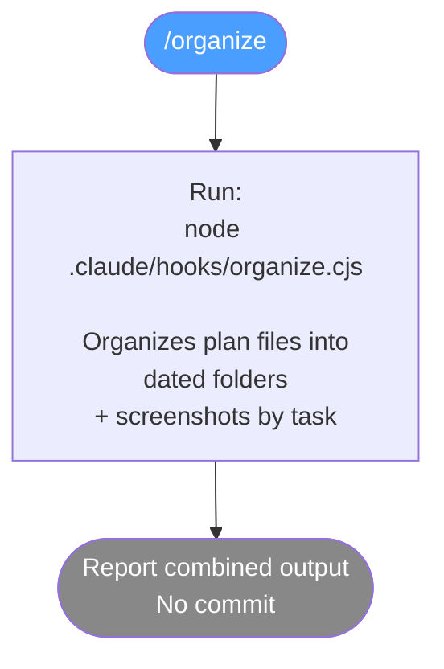

---

## /investigate

Structured debug investigation with root-cause analysis *before* fixes. Enforces four phases: reproduce → isolate → explain → propose. Writes the investigation record to `docs/.output/findings/investigations/{date}-{summary}.md`. Loads the `systematic-debugging` skill for rigor.

**Use when:** a bug has no obvious fix, a test failure is intermittent, or you want to prevent the fix-first-explain-later anti-pattern. The investigation doc is durable — it survives context compaction and becomes the bisect trail for future reopens.

**Output:** one `docs/.output/findings/investigations/*.md` file + optional commit containing the fix if one is proposed and approved.

---

## /remember

Capture a conversational insight to the day's daily log so it feeds the memory acquisition pipeline. Appends to `docs/.output/.state/memory-daily/{YYYY-MM-DD}.md` — one line per invocation, prefixed with an ISO timestamp. No commit. Structured memories are extracted manually (memory-extractor.js) or created directly via memory-manager.js create.

**Use when:** something surprising or non-obvious came up in conversation that's worth capturing but doesn't warrant a structured memory yet. Turn it into a structured memory later via `/review:memory-health` or `/review:promote-memories`.

---

## /listen

The first **post-MVP lifecycle** command. When the initial backlog drains, the harness has no model for *push-from-reality* work — bug reports, telemetry drift, unaddressed agent issues, expiring flags. `/listen` sweeps every available signal source (git reality, telemetry, agent-updates, backlog drift, optional external tracker), tags each finding with its provenance (`[origin: …]`), and writes a single dated intake file to `docs/.output/evolution/intake/{YYYY-MM-DD}.md` (day-rotated). It does **not** triage, prioritize, or ask questions — it only gathers. Commits the intake file. Pairs with `/triage`.

**Use when:** the initial backlog is drained and you need to discover what reality is asking for. Run it, then run `/triage`.

---

## /triage

The second **post-MVP lifecycle** command — the decision half of `/listen`. Reads the newest intake file and converts signals into ranked backlog stories. Built on two best-practice axes: (1) **Severity ≠ Priority** — it scores each signal's technical Severity objectively (engineering-led, no user input), then decides Priority separately as the *disposition*; (2) **auto-decide the obvious** — using the same Mechanical / Taste / User-Challenge model as `/do` Step 6c, it silently resolves mechanical calls and interviews **only** the genuine judgment calls (`AskUserQuestion`, ≤4/round, ≤3 rounds, like `/interview`).

Four dispositions: **promote** (→ backlog story, ordered by an ICE score + MoSCoW tag), **defer**, **kill** (reason recorded), **research** (→ spike). Kills and defers land in an append-only ledger (`docs/.output/evolution/triage/_decisions.md`, borrowed from Paperclip's durable issue state) so the next `/listen` sweep doesn't make you re-adjudicate them. Writes promoted stories to `docs/work/backlog.md`, a day-rotated run record to `docs/.output/evolution/triage/{date}.md`, and annotates the source intake inline. `--dry-run` classifies without writing.

**Use when:** a `/listen` intake file has accumulated and you want to turn it into prioritized backlog work. Then `/review:optimize-backlog` to slot the new stories, or `/do` the top one.

---

# Review

Sixteen commands for quality assurance, optimization, and project governance. Most run periodically — after an epic, before a release, or when something feels drifted. The `/review:check-*` commands are read-only diagnostics; the rest write artifacts to `docs/.output/findings/reviews/`.

## /review:code-review

Risk-tiered architecture compliance review. Reads the diff (file, PR number, git range, or auto = unstaged), classifies risk tiers (HIGH/MEDIUM/LOW) per file, routes to Deep / Standard / Fast-Lane review depth, dispatches `code-reviewer` with the `code-review` skill. Read-only — no commit.

```mermaid
flowchart TD
    START(["/review:code-review"]) --> SCOPE{INPUT type?}
    SCOPE -->|File path| READ_FILE[Read file]
    SCOPE -->|PR number| PR_DIFF["gh pr diff {number}"]
    SCOPE -->|Git range| GIT_DIFF["git diff {range}"]
    SCOPE -->|None| AUTO["git diff (unstaged)\nor git diff HEAD~1"]

    READ_FILE --> STANDARDS
    PR_DIFF --> STANDARDS
    GIT_DIFF --> STANDARDS
    AUTO --> STANDARDS

    STANDARDS["Load standards:\narchitecture/overview.md\nCLAUDE.md\nDomain skills (.ts/.cs/Tailwind)\nMemory: constraints, decisions"]

    STANDARDS --> RISK["Classify risk tiers\nper file using Risk Map\n(from code-reviewer agent)\nHIGH / MEDIUM / LOW"]

    RISK --> DEPTH{Overall\nreview depth?}
    DEPTH -->|Any HIGH| DEEP[Deep Review]
    DEPTH -->|All MEDIUM| STD[Standard Review]
    DEPTH -->|All LOW| FAST[Fast-Lane Review]

    DEEP --> DELEGATE
    STD --> DELEGATE
    FAST --> DELEGATE

    DELEGATE["Agent: code-reviewer\n(auto-loads code-review skill)\n\nEvaluate: Correctness, Security,\nPerformance, Architecture,\nMemory Pattern Compliance,\nTest Coverage\n\nSeverity: CRITICAL > MAJOR >\nMINOR > NIT"]

    DELEGATE --> REPORT(["Report:\nVerdict, file count,\nreview depth, findings\nby severity\nRead-only — no commit"])

    style START fill:#4a9eff,color:#fff
    style DELEGATE fill:#e74c3c,color:#fff
    style REPORT fill:#888,color:#fff
```

---

## /review:security

OWASP Top 10 audit, vulnerability detection, secret scanning, threat modeling. Dispatches `security-auditor` with the `code-review` skill. Writes audit results to `docs/.output/findings/reviews/security-{date}.md`.

```mermaid
flowchart TD
    START(["/review:security"]) --> SCOPE{INPUT type?}
    SCOPE -->|File path| READ_FILE[Read file]
    SCOPE -->|PR number| PR_DIFF["gh pr diff {number}"]
    SCOPE -->|Git range| GIT_DIFF["git diff {range}"]
    SCOPE -->|None| AUTO["git diff (unstaged)\nor git diff HEAD~1"]

    READ_FILE --> CTX
    PR_DIFF --> CTX
    GIT_DIFF --> CTX
    AUTO --> CTX

    CTX["Gather security context:\narchitecture/overview.md\nproduct/requirements.md\nGlob: *.env*, auth/*, middleware/*\nMemory: security constraints"]

    CTX --> DELEGATE["Agent: security-auditor\n(auto-loads code-review skill)\n\nOWASP Top 10 assessment\nSecret/credential scan\nAuthorization audit\nInput validation check\nAttack chain analysis\n\nSeverity: CRITICAL > HIGH >\nMEDIUM > LOW"]

    DELEGATE --> REPORT(["Report:\nThreat model, OWASP table,\nfindings by severity,\nattack chains, secret scan,\nrecommended actions\nWrite scope: review artifacts only"])

    style START fill:#4a9eff,color:#fff
    style DELEGATE fill:#e74c3c,color:#fff
    style REPORT fill:#888,color:#fff
```

---

## /review:qa

Generate tests for existing code using acceptance criteria from stories. Supports scope by story number, file path, module name, or coverage-gap analysis. Dispatches `qa-engineer`; runs the test suite to verify all pass before committing.

```mermaid
flowchart TD
    START(["/review:qa"]) --> SCOPE{INPUT type?}
    SCOPE -->|Story number| STORY["Read story from\nwork/backlog.md\nGet AC + impl files"]
    SCOPE -->|File path| FILE["Read file\nCheck if tests exist"]
    SCOPE -->|Module name| MODULE["Find all module files\nIdentify untested ones"]
    SCOPE -->|None| COVERAGE["Coverage analysis:\nbusiness logic > data >\nAPI > UI"]

    STORY --> DETECT
    FILE --> DETECT
    MODULE --> DETECT
    COVERAGE --> DETECT

    DETECT["Detect test framework:\n*.Tests.csproj, jest.config,\nkarma.conf, playwright.config\nRead existing test patterns\nRead Testing Strategy section"]

    DETECT --> DELEGATE["Agent: qa-engineer\n(auto-loads qa-engineer skill)\n\nMap AC → test names\nUnit / Integration / E2E\nArrange-Act-Assert\nHappy path + error paths\nNaming: Method_Scenario_Expected"]

    DELEGATE --> RUN["Run test suite:\nnpm test / dotnet test /\npytest / cargo test\nVerify all pass"]

    RUN --> COMMIT["Commit:\nNew test files\nPer Post-Command Convention"]

    COMMIT --> REPORT(["Report:\nScope, tests generated,\nall passing?, coverage notes,\ncommit hash"])

    style START fill:#4a9eff,color:#fff
    style DELEGATE fill:#7b68ee,color:#fff
    style RUN fill:#e74c3c,color:#fff
    style COMMIT fill:#2ecc71,color:#fff
    style REPORT fill:#888,color:#fff
```

---

## /review:check-readiness

Gate check before implementation begins. Verifies required docs exist (PRD, architecture, backlog), runs the epic file-overlap detector against `backlog.md` (with `## Acknowledged Overlaps` escape hatch), checks completeness against skill checklists, cross-document consistency, and scans for ambiguity. Produces a PASS / CONCERNS / FAIL verdict. Read-only — no commit.

```mermaid
flowchart TD
    START(["/review:check-readiness"]) --> DOCS["Check required docs exist:\nproduct/requirements.md (REQ)\narchitecture/overview.md (REQ)\nwork/backlog.md (REQ)\nproduct/brief.md (REC)\ndesign/spec.md (if UI)\ndesign/* files (if UI)"]

    DOCS --> MISSING{Any required\ndoc missing?}
    MISSING -->|Yes| FAIL_FAST(["FAIL:\nMissing docs listed\nInstructions to create"])

    MISSING -->|No| OVERLAP["Run epic-overlap.js on backlog.md:\nflag any cross-epic shared files"]

    OVERLAP --> ACK{Overlaps found?}
    ACK -->|No| COMPLETE
    ACK -->|Yes, all listed in\n## Acknowledged Overlaps| COMPLETE
    ACK -->|Yes, unacknowledged| FAIL_OVERLAP(["FAIL:\nUnacknowledged overlaps\nlist pairs + suggest fixes"])

    COMPLETE["Check completeness\nper skill checklists:\nPRD → project-planning\nArch → architecture\nDesign → ux-design\nEpics → project-planning"]

    COMPLETE --> CONSISTENCY["Cross-document consistency:\nTech stack matches epics?\nEvery Must-Have FR → story?\nNFRs in architecture?\nPRD entities in data design?\nSecurity reqs → auth section?"]

    CONSISTENCY --> AMBIGUITY["Scan for ambiguity:\n'appropriate', 'correctly',\n'properly', 'as needed'\nNFRs without targets\nStories without AC\nMissing error handling"]

    AMBIGUITY --> VERDICT{Generate verdict}
    VERDICT -->|All good| PASS(["PASS:\nAll docs complete,\nconsistent, unambiguous"])
    VERDICT -->|Issues found| CONCERNS(["CONCERNS:\nDocs exist but issues\nshould be fixed"])
    VERDICT -->|Critical gaps| FAIL(["FAIL:\nCannot proceed\nCritical issues listed"])

    style START fill:#4a9eff,color:#fff
    style FAIL_FAST fill:#e74c3c,color:#fff
    style FAIL_OVERLAP fill:#e74c3c,color:#fff
    style PASS fill:#2ecc71,color:#fff
    style CONCERNS fill:#f5a623,color:#fff
    style FAIL fill:#e74c3c,color:#fff
```

---

## /review:check-sync

Detect documentation drift from reality. Reads architecture, TODO statuses, PRD coverage, and internal links; flags mismatches. Produces a report at `docs/.output/findings/reviews/{date}-sync-check.md`. Read-only — no commit. Pair with `/review:update-docs` to fix.

```mermaid
flowchart TD
    START(["/review:check-sync"]) --> SCOPE{INPUT scope?}
    SCOPE -->|all / default| ALL[Check everything]
    SCOPE -->|architecture| ARCH_ONLY[Architecture only]
    SCOPE -->|stories| STORY_ONLY[Story status only]
    SCOPE -->|prd| PRD_ONLY[PRD only]

    ALL --> ARCH
    ARCH_ONLY --> ARCH

    ARCH["Architecture Sync:\nRead architecture/overview.md\nGlob actual project files\nFlag: deps not in packages,\nnon-existent paths,\nunlisted dependencies,\npattern mismatches"]

    ALL --> STORIES
    STORY_ONLY --> STORIES

    STORIES["Epic/Story Status Sync:\nRead TODO_epic*.md\nFor [x] stories: verify commits exist\nFor [ ] stories: check if implemented\nCheck master index counts"]

    ALL --> PRD
    PRD_ONLY --> PRD

    PRD["PRD Sync (informational):\nRead product/requirements.md\nSearch codebase per FR\nNote: implemented/partial/missing"]

    ALL --> DEAD

    DEAD["Dead Reference Check:\nRead all docs/*.md\nExtract internal links\nVerify targets exist"]

    ARCH --> REPORT
    STORIES --> REPORT
    PRD --> REPORT
    DEAD --> REPORT

    REPORT(["Report:\nArch sync table\nStory status table\nPRD coverage table\nDead references\nRecommended actions\nRead-only — no commit"])

    style START fill:#4a9eff,color:#fff
    style REPORT fill:#888,color:#fff
```

---

## /review:update-docs

Apply fixes for drift found by `/review:check-sync`. Classifies each drift item as auto-fixable, needs-confirmation, or manual. Dispatches `doc-writer` (Haiku) for approved auto-fixes. Commits all modified docs.

```mermaid
flowchart TD
    START(["/review:update-docs"]) --> SYNC["Run /check-sync\nCapture drift report"]

    SYNC --> DRIFT{Any drift\nfound?}
    DRIFT -->|No| DONE(["Docs are in sync.\nNothing to update."])

    DRIFT -->|Yes| CLASSIFY["Classify each drift item:\n\nAuto-fixable:\n  [ ] story with commits → [x]\n  Stale index counts\n  New dep not in arch\n  Dead internal link\n\nConfirm:\n  [x] story with no commits\n\nManual:\n  New code pattern not in arch"]

    CLASSIFY --> PREVIEW["Preview changes:\nAuto-fixable (N)\nNeed Confirmation (N)\nManual Action Required (N)"]

    PREVIEW --> ASK{"Apply N\nauto-fixable\nchanges?"}
    ASK -->|No| MANUAL_ONLY(["Manual actions listed\nNo changes applied"])
    ASK -->|Yes| DELEGATE["Agent: doc-writer\nApply approved changes:\nUpdate TODO checkboxes\nRecalculate index counts\nAdd/remove arch deps\nNEVER modify backlog.md"]

    DELEGATE --> CTX_UPD["Update product/context.md\nstats if significant changes"]

    CTX_UPD --> COMMIT["Commit:\nAll modified docs"]
    COMMIT --> REPORT(["Report:\nChanges applied,\nstill out of sync,\ncommit hash"])

    style START fill:#4a9eff,color:#fff
    style DONE fill:#888,color:#fff
    style DELEGATE fill:#f5a623,color:#fff
    style COMMIT fill:#2ecc71,color:#fff
    style REPORT fill:#888,color:#fff
```

---

## /review:check-templates

Audit the `.claude/` system health. Scans agents, skills, hooks, commands, settings. Cross-references each surface against its callers. Scores 0-50 across 5 dimensions. Optionally scans sibling repos with `--multi` for cross-project drift. Read-only — no commit.

```mermaid
flowchart TD
    START(["/review:check-templates"]) --> MULTI{--multi flag?}

    MULTI -->|No| SCAN
    MULTI -->|Yes| SCAN

    SCAN["Step 1-5: Scan inventory\nAgents: .claude/agents/*.md\nSkills: .claude/skills/*/SKILL.md\nHooks: .claude/hooks/*.cjs\nCommands: .claude/commands/**/*.md\nSettings: .claude/settings.json"]

    SCAN --> XREF["Step 6: Cross-reference\n6a. Agent → command refs\n6b. Skill → agent frontmatter\n6c. Hook → settings.json\n6d. Command → agent refs"]

    XREF --> VERSION["Step 7: Read\n.claude/version.json"]

    VERSION --> SCORE["Step 8: Score (0-50)\nAgents: 0-10\nSkills: 0-10\nHooks: 0-10\nCommands: 0-10\nSettings: 0-10"]

    SCORE --> REPORT{--multi?}
    REPORT -->|No| SINGLE(["Report:\nHealth score, wiring tables,\nissues, recommendations\nRead-only — no commit"])

    REPORT -->|Yes| SIBLINGS["Step 10: Scan sibling repos\nRead version.json per project\nCount agents/hooks/skills\nCompare versions (semver)"]

    SIBLINGS --> FULL(["Report:\nSingle-project report +\ncross-project version table,\ndrift analysis,\nupdate recommendations\nRead-only — no commit"])

    style START fill:#4a9eff,color:#fff
    style SCORE fill:#f5a623,color:#fff
    style SINGLE fill:#888,color:#fff
    style FULL fill:#888,color:#fff
```

---

## /review:optimize-backlog

Build dependency graph, compute critical path, identify parallel workstreams and bottlenecks. Dispatches `project-planner`. Optionally annotates or rewrites `backlog.md`; can also run report-only. **Hard gate:** needs `docs/work/backlog.md`.

```mermaid
flowchart TD
    START(["/review:optimize-backlog"]) --> YOLO{--yolo?}
    YOLO -->|Yes| STRIP[Strip flag]
    YOLO -->|No| GATE
    STRIP --> GATE

    GATE{backlog.md\nexists & not template?}
    GATE -->|No| YOLO_CHK{YOLO?}
    YOLO_CHK -->|No| STOP(["STOP: Run\n/project-epics first"])
    YOLO_CHK -->|Yes| WARN[Warn, skip optimization]
    GATE -->|Yes| READ["Read backlog.md\n+ architecture/overview.md"]

    READ --> GRAPH["Build dependency graph:\nRoot nodes (no deps)\nLeaf nodes (nothing depends)\nHigh fan-out (bottlenecks)\nCross-phase deps\nCross-package boundaries"]

    GRAPH --> COMPUTE["Compute:\nCritical path (longest chain)\nParallel workstreams\n(no shared deps)"]

    COMPUTE --> DELEGATE["Agent: project-planner\nProduce:\nA. Dependency Graph (ASCII)\nB. Critical Path Analysis\nC. Parallel Workstreams\nD. Over-Specified Dependencies\nE. Phase Optimization\nF. Sprint-by-sprint plan"]

    DELEGATE --> VALIDATE["Validate:\nCritical path is longest?\nParallel tracks no hidden deps?\nRecs don't violate arch?"]

    VALIDATE --> ASK{Apply\noptimizations?}
    ASK -->|Report only| REPORT
    ASK -->|Annotations| ANNOTATE["Add parallel workstream\nmarkers to backlog.md"]
    ASK -->|Full rewrite| REWRITE["Restructure\nphases/dependencies"]

    ANNOTATE --> COMMIT["Commit:\nwork/backlog.md"]
    REWRITE --> COMMIT

    COMMIT --> REPORT(["Report:\nStories analyzed,\ncritical path, parallel tracks,\noptimizations found,\ncommit hash (if applied)"])

    style START fill:#4a9eff,color:#fff
    style STOP fill:#e74c3c,color:#fff
    style DELEGATE fill:#2ecc71,color:#fff
    style COMMIT fill:#2ecc71,color:#fff
    style REPORT fill:#888,color:#fff
```

---

## /review:optimize-agents

Re-align agents with the actual codebase once implementation is underway. Scans package files, project structure, framework detection; compares against each agent's `## Project Context` section; updates drifted agents. Audits skills and memory health. Modes: `--fix` (write), `--dry-run` (preview), `--report-only` (no changes).

```mermaid
flowchart TD
    START(["/review:optimize-agents"]) --> PHASE{Phase 4+?\nImpl underway?}
    PHASE -->|No| SUGGEST(["Suggest /specialize\ninstead"])
    PHASE -->|Yes| SCAN

    SCAN["Scan actual codebase:\n1a. Package files (all languages)\n1b. Project structure\n1c. Framework detection\n1d. Implemented patterns\nBuild DETECTED_STACK model"]

    SCAN --> COMPARE["Compare each .claude/agents/*.md:\nRead Project Context section\nvs scanned codebase\nClassify: CURRENT / DRIFTED / MISSING"]

    COMPARE --> MEMORY["Read proven patterns\nfrom memory (confidence >= 0.7)\nCheck for promotable patterns (0.6)"]

    MEMORY --> RETRO["Read docs/.output/findings/reviews/retro-*.md\nExtract System Improvements\nAgent/Skill/Command/Memory findings"]

    RETRO --> MODE{--fix / --dry-run /\n--report-only?}

    MODE -->|--fix| UPDATE["Update drifted agents:\nReplace ## Project Context\nTech Stack, Proven Patterns,\nConstraints, Key Decisions,\nProject Structure"]
    MODE -->|--dry-run| DRY[Report what would change]
    MODE -->|--report-only| RPT[Report only]

    UPDATE --> SKILLS["Audit skills:\nRelevance check vs DETECTED_STACK\nGap check: techs with no skill\nRetro check: flagged skills"]

    DRY --> SKILLS
    RPT --> SKILLS

    SKILLS --> MEM_HEALTH["Memory health:\nRun memory-manager report\nStale patterns (wrong files/techs)\nMissing patterns (3+ file usage)"]

    MEM_HEALTH --> COMMIT{Changes made?}
    COMMIT -->|Yes| DO_COMMIT["Commit:\nModified agent files"]
    COMMIT -->|No| REPORT

    DO_COMMIT --> REPORT(["Report:\nDetected stack, agent alignment,\nskill audit, memory health,\nrecommendations"])

    style START fill:#4a9eff,color:#fff
    style SUGGEST fill:#888,color:#fff
    style UPDATE fill:#f5a623,color:#fff
    style DO_COMMIT fill:#2ecc71,color:#fff
    style REPORT fill:#888,color:#fff
```

---

## /review:specialize

Customize the template for your tech stack. Extracts tech stack from `architecture/overview.md`, specializes each default agent's `## Project Context` section, creates stack-specific agents (e.g., `db-architect`, `auth-builder`) as warranted, generates missing framework skills, wires skills into agent frontmatter, seeds memory with ADRs, and verifies build/test gate detection.

```mermaid
flowchart TD
    START(["/review:specialize"]) --> PHASE{Phase 3+?\nArch + epics exist?}
    PHASE -->|No| ABORT(["ABORT:\nMissing artifacts"])

    PHASE -->|Yes| EXTRACT["Extract from architecture/overview.md:\nBackend, Frontend, Database,\nInfrastructure, Auth, Testing,\nCross-Cutting, all ADRs,\nProject Identity"]

    EXTRACT --> PLACEHOLDER{Unfilled\nplaceholders?}
    PLACEHOLDER -->|Yes| ABORT2(["ABORT:\nRun /project-architecture first"])
    PLACEHOLDER -->|No| SPECIALIZE

    SPECIALIZE["Specialize each default agent:\nAppend/replace ## Project Context\nTech stack slice per role\nKey patterns, relevant ADRs,\nconventions\nIDEMPOTENT: replace if exists\nDO NOT touch Soul Zone"]

    SPECIALIZE --> NEW_AGENTS["Create stack-specific agents:\ndb-architect, auth-builder,\nfrontend-specialist, api-specialist,\netc. (based on arch sections)\nSkip if default agent covers it"]

    NEW_AGENTS --> SCRIPTS["Verify build & test gate:\ngate.js auto-detects toolchain\nOverride with gate.config.json\nSkip if already configured"]

    SCRIPTS --> RISK_MAP["Generate Risk Map\nfor code-reviewer:\nHIGH: auth, security, payment\nMEDIUM: services, API, domain\nLOW: config, docs, utils\nAppend to code-reviewer context"]

    RISK_MAP --> SKILL_AUDIT["Audit skills:\nRelevant / Not-applicable /\nNeeds-framework-skill\nGap detection per tech"]

    SKILL_AUDIT --> GEN_SKILLS{Gaps found?}
    GEN_SKILLS -->|Yes| CREATE_SKILLS["Agent: architect\nGenerate .claude/skills/\n{tech-slug}-patterns/SKILL.md\nProject-specific > generic"]
    GEN_SKILLS -->|No| WIRE

    CREATE_SKILLS --> WIRE["Wire skills into agents:\nUpdate frontmatter skills: list\ncode-reviewer → all stack skills\nqa-engineer → testing + framework\narchitect → all stack skills"]

    WIRE --> SEED["Seed memory system:\nADR decisions (confidence 0.9)\nArchitectural patterns (0.9)\nRun memory health check"]

    SEED --> VERIFY["Verify command integration:\nGrep for memory-manager usage\nClassify: INTEGRATED / PARTIAL"]

    VERIFY --> COMMIT["Commit:\nAll created/modified files"]
    COMMIT --> REPORT(["Report:\nTech stack, agents updated,\nnew agents, scripts, risk map,\nskills audit/generated/wired,\nmemory seeded, commit hash"])

    style START fill:#4a9eff,color:#fff
    style ABORT fill:#e74c3c,color:#fff
    style ABORT2 fill:#e74c3c,color:#fff
    style SPECIALIZE fill:#f5a623,color:#fff
    style NEW_AGENTS fill:#7b68ee,color:#fff
    style CREATE_SKILLS fill:#7b68ee,color:#fff
    style COMMIT fill:#2ecc71,color:#fff
    style REPORT fill:#888,color:#fff
```

---

## /review:personalize

Give agents names, nicknames, and soul-level identity. Walks each agent file, offers persona directions (e.g., code-reviewer → Magistrate / Hawk / Mentor / Surgeon) and name options, delegates soul-zone writing to `doc-writer`. Applies soul zone between `---` (end of frontmatter) and `## Project Context`. Preserves the specialization zone intact.

```mermaid
flowchart TD
    START(["/review:personalize"]) --> DISCOVER["Scan .claude/agents/*.md\nFor each agent:\nRead frontmatter (name, nickname)\nDetect soul: Has Soul / Default / Thin\nDetect specialize: Specialized / Not"]

    DISCOVER --> ROSTER["Present agent roster table:\n#, Agent, Name, Soul,\nSpecialized, Action Needed"]

    ROSTER --> WALK["Walk through each agent:"]

    WALK --> HAS_SOUL{Agent has\nsoul?}
    HAS_SOUL -->|Yes| ASK_SOUL{"Skip / Update\npersona / Rename?"}
    HAS_SOUL -->|No| ASK_CREATE{"Create soul\nor Skip?"}

    ASK_SOUL -->|Skip| NEXT{More agents?}
    ASK_SOUL -->|Update/Rename| PERSONA
    ASK_CREATE -->|Skip| NEXT
    ASK_CREATE -->|Create| PERSONA

    PERSONA["Offer persona directions:\n3-4 options tailored to role\n+ 'Other'\ne.g. code-reviewer:\nMagistrate / Hawk / Mentor / Surgeon"]

    PERSONA --> NAME["Offer name options:\n4-5 fitting archetype\n+ 'Other'"]

    NAME --> DELEGATE["Agent: doc-writer\nWrite soul zone:\n# {Nickname} — {Role Title}\n## Identity\n## Decision Philosophy\n## Working Style\n## Quality Standards\n\nDO NOT produce frontmatter\nor Project Context"]

    DELEGATE --> APPLY["Apply to agent file:\nUpdate frontmatter:\n  nickname, aliases\nReplace soul zone\n(between --- and ## Project Context)\nPreserve Project Context intact"]

    APPLY --> NEXT
    NEXT -->|Yes| WALK
    NEXT -->|No| COMMIT["Commit:\nAll modified agent files"]

    COMMIT --> REPORT(["Report:\nAgents updated table,\nfinal roster, stats,\ncommit hash"])

    style START fill:#4a9eff,color:#fff
    style PERSONA fill:#f5a623,color:#fff
    style DELEGATE fill:#f5a623,color:#fff
    style COMMIT fill:#2ecc71,color:#fff
    style REPORT fill:#888,color:#fff
```

---

## /retro

Run a retrospective after completing an epic. Runs a **code-review pass over the epic's commits first** (`code-reviewer`, risk-routed — its findings feed the retro); `--skip-review` skips it when the epic was already reviewed (e.g. inside `/sweep`, whose Phase 1 satisfies it). Gathers commits, TODO state, work docs, and memory patterns from the epic's window; runs `/review:check-sync` alongside. Dispatches `doc-writer` to write `docs/.output/findings/reviews/retro-{epic-slug}.md` (the code-review findings land in its **Code Review Findings** section — no separate file). Extracts patterns to memory (confidence 0.8 new, promotes 0.6 → 0.8+ existing).

```mermaid
flowchart TD
    START(["/retro"]) --> INPUT{INPUT\nprovided?}
    INPUT -->|Yes| MATCH["Match against epic\nnames/numbers in\nwork/backlog.md"]
    INPUT -->|No| FIND{Most recently\ncompleted epic?}
    FIND -->|Found| MATCH
    FIND -->|None complete| ASK["Ask user which\nepic to review"]
    ASK --> MATCH

    MATCH --> REVIEW{"--skip-review?"}
    REVIEW -->|No| CR["Agent: code-reviewer\nReview epic commit range\n(risk-routed: HIGH→opus)\n→ findings feed retro doc"]
    REVIEW -->|Yes| GATHER
    CR --> GATHER["Gather data:\n\nCode-review findings (Step 2)\n\nGit: commits, files changed,\nlines, date range\n\nTODO: Execution Log,\nKey Decisions, deferred [~],\nblocked [!]\n\nWork docs: plans from\n.output/plans/\n\nMemory: patterns extracted\nduring epic"]

    GATHER --> SYNC["Run /check-sync\nCapture drift findings"]

    SYNC --> DELEGATE["Agent: doc-writer\nWrite docs/.output/findings/reviews/retro-{epic-slug}.md:\n\nWhat Went Well\nWhat Didn't Go Well\nKey Decisions (table)\nPatterns Extracted (table)\nCode Review Findings (from Step 2)\nMetrics (commits, files, lines,\nbuild/test failures, findings, first-attempt)\nRecommendations\nSystem Improvements\n  (Agent/Skill/Command/Memory)\nDoc Sync Summary"]

    DELEGATE --> PATTERNS["Extract patterns to memory:\nNew patterns → confidence 0.8\nExisting /do patterns (0.6) →\npromote to 0.8+"]

    PATTERNS --> COMMIT["Commit:\ndocs/.output/findings/reviews/retro-{epic-slug}.md\n+ memory updates"]

    COMMIT --> REPORT(["Report:\nOutput file, patterns extracted,\nkey takeaway, commit hash,\nnext epic"])

    style START fill:#4a9eff,color:#fff
    style DELEGATE fill:#f5a623,color:#fff
    style COMMIT fill:#2ecc71,color:#fff
    style REPORT fill:#888,color:#fff
```

---

## /review:changelog

Write release notes. Determines scope (version tag, date range, or most-recent-tag-to-HEAD), gathers commits + epic completions + retro decisions + daily logs, classifies changes (Added / Changed / Fixed / Removed / Security / Infrastructure / Documentation), prepends to `docs/CHANGELOG.md`.

```mermaid
flowchart TD
    START(["/review:changelog"]) --> SCOPE{INPUT type?}
    SCOPE -->|Version tag| TAG{"Tag exists\nin git?"}
    TAG -->|Yes| RANGE_TAG["From previous tag\nto this tag"]
    TAG -->|No| RANGE_NEW["New release:\nlast tag to HEAD"]
    SCOPE -->|Date range| RANGE_DATE["Commits within\ndate range"]
    SCOPE -->|None| RANGE_AUTO["From most recent tag\nto HEAD\n(or all commits if no tags)"]

    RANGE_TAG --> GATHER
    RANGE_NEW --> GATHER
    RANGE_DATE --> GATHER
    RANGE_AUTO --> GATHER

    GATHER["Gather data:\n\nGit: commits, files changed,\ncontributors\n\nEpics: completed stories\nin scope period\n\nRetros: key decisions,\npattern changes\n\nDaily logs: session context,\nkey decisions"]

    GATHER --> DELEGATE["Agent: doc-writer\nClassify changes:\nAdded / Changed / Fixed /\nRemoved / Security /\nInfrastructure / Documentation\n\nDerive from: commit prefixes,\nstory titles, daily log entries\n\nInclude stats:\nStories, commits, files,\nlines, contributors, epics"]

    DELEGATE --> MERGE{CHANGELOG.md\nexists?}
    MERGE -->|Yes| PREPEND["Prepend new version\nabove existing content"]
    MERGE -->|No| CREATE["Create CHANGELOG.md\nwith header +\nversion section"]

    PREPEND --> COMMIT["Commit:\ndocs/CHANGELOG.md"]
    CREATE --> COMMIT

    COMMIT --> REPORT(["Report:\nVersion, period,\nAdded/Changed/Fixed counts,\nstories covered,\ncommit hash\nNext: git tag {version}"])

    style START fill:#4a9eff,color:#fff
    style DELEGATE fill:#f5a623,color:#fff
    style COMMIT fill:#2ecc71,color:#fff
    style REPORT fill:#888,color:#fff
```

---

## /review:memory-health

Extract (opt-in) + lint + decay health check. Optionally runs the Haiku extractor first, then runs lint + decay report. Silent if healthy (score=70, stale=0); otherwise reports the full breakdown. Read-only — no commit.

```mermaid
flowchart TD
    START(["/review:memory-health"]) --> EXTRACT{CLAUDE_MEMORY_AUTO_EXTRACT\n= 1?}

    EXTRACT -->|Yes| RUN_EXT["Run:\nmemory-extractor.js extract"]
    EXTRACT -->|No| LINT

    RUN_EXT --> LINT["Step 2: Lint\nmemory-manager.js lint\n7-point check, score 0-70"]

    LINT --> DECAY["Step 3: Decay Report\nmemory-manager.js decay-report\nCount stale (< 0.3)\nCount archive (< 0.1)"]

    DECAY --> EVAL{All healthy?\nscore=70 + stale=0}

    EVAL -->|Yes| SILENT(["[SILENT] Memory system\nhealthy — nothing to process"])

    EVAL -->|No| FULL(["Full report:\nSummary table, lint issues,\nstale memories table,\nrecommendations\nRead-only — no commit"])

    style START fill:#4a9eff,color:#fff
    style SILENT fill:#888,color:#fff
    style FULL fill:#888,color:#fff
```

---

## /review:promote-memories

Scan high-confidence compiled concepts + hand-created memories, surface candidates for promotion into templates, skills, or agents. Walks each candidate: presents summary + suggested target → asks user decision → applies promotion via Edit + marks concept as promoted. Commits target files and concept articles.

```mermaid
flowchart TD
    START(["/review:promote-memories"]) --> SCAN["Step 1: Scan\nmemory-promoter.js scan --top 10"]

    SCAN --> EMPTY{Candidates\nfound?}
    EMPTY -->|No| DONE(["No concepts meet\npromotion criteria"])

    EMPTY -->|Yes| PRESENT["Step 2: Present each candidate:\nTitle, category, score\nSummary, sources, cross-refs\nSuggested target file"]

    PRESENT --> ASK{"User decision?"}
    ASK -->|Accept| APPLY["Step 3: Apply promotion\nRead target file\nDraft addition\nShow user for confirmation\nApply via Edit\nRun: promoter.js mark {slug}"]
    ASK -->|Reject/Skip| NEXT{More\ncandidates?}
    ASK -->|Done| COMMIT_CHK

    APPLY --> NEXT
    NEXT -->|Yes| PRESENT
    NEXT -->|No| COMMIT_CHK

    COMMIT_CHK{Any accepted?}
    COMMIT_CHK -->|No| REPORT
    COMMIT_CHK -->|Yes| COMMIT["Commit:\nModified target files +\nconcept articles"]

    COMMIT --> REPORT(["Report:\nCandidate table with\nAccepted/Rejected/Skipped,\ntargets, commit hash"])

    style START fill:#4a9eff,color:#fff
    style DONE fill:#888,color:#fff
    style APPLY fill:#f5a623,color:#fff
    style COMMIT fill:#2ecc71,color:#fff
    style REPORT fill:#888,color:#fff
```

---

## /review:timeline

Generate or update `docs/work/timeline.md` with weekly commit history. Runs `node .claude/core/gen-timeline.js` which reads `git log`, groups commits by ISO week, and writes a running ledger. Commits the updated timeline file.

**Use when:** `/end` flags the timeline as stale, or when you want a retrospective view of what shipped when. The timeline is also consumed by `/review:changelog` as one of its upstream data sources.

**Output:** overwritten `docs/work/timeline.md` + commit `docs: /review:timeline — update {N} weeks`.

---

# Appendix A: Command dependency flow

The Setup commands have hard dependency gates. This graph shows which command must run before which:

```mermaid
graph LR
    B["/brainstorm"] --> PB["/create:project-brief"]
    R["/research"] --> PB
    I["/interview"] -.-> PB
    PB --> PR["/create:project-requirements"]
    B --> PR
    R --> PR
    PR --> PA["/create:project-architecture"]
    PR --> PD["/create:project-design"]
    PR --> PE["/create:project-epics"]
    PA --> PE
    PE --> PT["/create:project-todo"]
    PE --> PET["/create:project-epics-todo"]
    PA -.-> PT
    PA -.-> PET

    style B fill:#4a9eff,color:#fff
    style R fill:#4a9eff,color:#fff
    style I fill:#4a9eff,color:#fff
    style PB fill:#f5a623,color:#fff
    style PR fill:#f5a623,color:#fff
    style PA fill:#7b68ee,color:#fff
    style PD fill:#7b68ee,color:#fff
    style PE fill:#2ecc71,color:#fff
    style PT fill:#2ecc71,color:#fff
    style PET fill:#2ecc71,color:#fff
```

**Legend:** Solid edge = hard gate (command refuses to run without it). Dashed edge = optional upstream context. Bypass any hard gate with `--yolo`. The full list of gated commands is in `CLAUDE.md` under "Hard Gates."

The Build Loop has a cyclical shape — `/do` repeats until the TODO is burned down, then the session ends with `/end`:

```mermaid
graph LR
    PR["/prime"] --> TD["/todo"]
    TD --> DO["/do"]
    DO -->|repeat| DO
    DO --> RT["/run-tests"]
    RT --> ES["/end"]

    RUN["/run-todo"] -->|alternative to\nmanual /do loop| RT

    ORG["/organize"] -.->|housekeeping| ES

    style PR fill:#4a9eff,color:#fff
    style TD fill:#f5a623,color:#fff
    style DO fill:#e74c3c,color:#fff
    style RUN fill:#e74c3c,color:#fff
    style RT fill:#7b68ee,color:#fff
    style ES fill:#2ecc71,color:#fff
    style ORG fill:#888,color:#fff
```

---

# Appendix B: Agent usage summary

Which commands dispatch which agents. Use this when deciding where a change in an agent's behavior will be felt.

| Agent | Dispatched by |
|-------|-----------------|
| `product-strategist` | `/brainstorm`, `/research`, `/create:project-brief`, `/create:project-requirements`, `/create:module`, `/review:check-readiness`, `/review:check-sync` |
| `architect` | `/create:project-architecture`, `/create:module`, `/review:specialize`, `/review:check-readiness`, `/review:check-sync` |
| `ux-designer` | `/create:project-design`, `/create:module`, `/review:check-readiness` |
| `project-planner` | `/create:project-epics`, `/create:project-todo`, `/create:project-epics-todo`, `/todo`, `/review:optimize-backlog`, `/review:check-readiness`, `/review:check-sync` |
| `general-purpose` | `/do` (implementation), `/run-todo` (dev agents), `/create:module`, `/run-tests` (code checks) |
| `code-reviewer` | `/review:code-review`, `/retro` (code-review pass), `/todo` (large review), `/run-todo` (wave review) |
| `qa-engineer` | `/review:qa`, `/run-todo` (QA agents), `/do` (Path B TDD delegation) |
| `doc-writer` | `/review:update-docs`, `/review:personalize`, `/retro`, `/review:changelog`, `/do` (TODO update sub-task) |
| `security-auditor` | `/review:security`, `/review:check-readiness` (architecture security context) |
| `playwright` | `/run-tests` (browser testing) |
| `shadow` | (available for ad-hoc ghostwriting; not invoked directly by any command) |

Commands also dispatch the built-in `Explore` agent (not a custom agent in `.claude/agents/`) for broad codebase research — used by `/prime`, `/research`, `/run-tests`, and others.

---

# Appendix C: Commit behavior summary

| Commits | Commands |
|---------|----------|
| **Yes — on completion** | `/brainstorm`, `/research`, `/create:*` (all 11), `/end`, `/review:qa`, `/review:update-docs`, `/review:optimize-backlog` (if apply), `/review:optimize-agents` (if `--fix`), `/review:specialize`, `/review:personalize`, `/retro`, `/review:changelog`, `/review:promote-memories` (if accepted), `/review:timeline` |
| **Yes — per task or wave** | `/do` (per task), `/run-todo` (per wave) |
| **No — read-only or chat-only** | `/interview`, `/prime`, `/todo`, `/run-tests`, `/organize`, `/status`, `/remember`, `/review:code-review`, `/review:security`, `/review:check-readiness`, `/review:check-sync`, `/review:check-templates`, `/review:memory-health` |
| **Conditional** | `/investigate` — commits only if a fix is proposed and approved |

---

# Appendix D: Color legend for diagrams

All mermaid diagrams in this reference use a consistent color scheme. A node's color indicates its role in the flow:

| Color | Hex | Meaning |
|-------|------|---------|
| Blue | `#4a9eff` | Entry point / discovery |
| Orange | `#f5a623` | Agent delegation / user interaction |
| Purple | `#7b68ee` | Design / architecture / QA agents |
| Red | `#e74c3c` | Implementation / gates / stops |
| Green | `#2ecc71` | Planning / commits |
| Gray | `#888` | Reports / endpoints |

---

## See also

- [`../concepts/commands.md`](../concepts/commands.md) — what commands are, the orchestration pattern, commands vs agents vs skills
- [`../concepts/agents.md`](../concepts/agents.md) — the 11-agent inventory with model hierarchy
- [`../concepts/skills.md`](../concepts/skills.md) — auto-load skills and the user-invocable catalog
- [`../concepts/hooks.md`](../concepts/hooks.md) — the deterministic event layer that runs alongside commands
- [`../concepts/memory.md`](../concepts/memory.md) — the auto-compound pipeline
- [`./system-map.md`](./system-map.md) — the full system inventory and workflow graphs
- [`./customization.md`](./customization.md) — zone map for safe template sync
