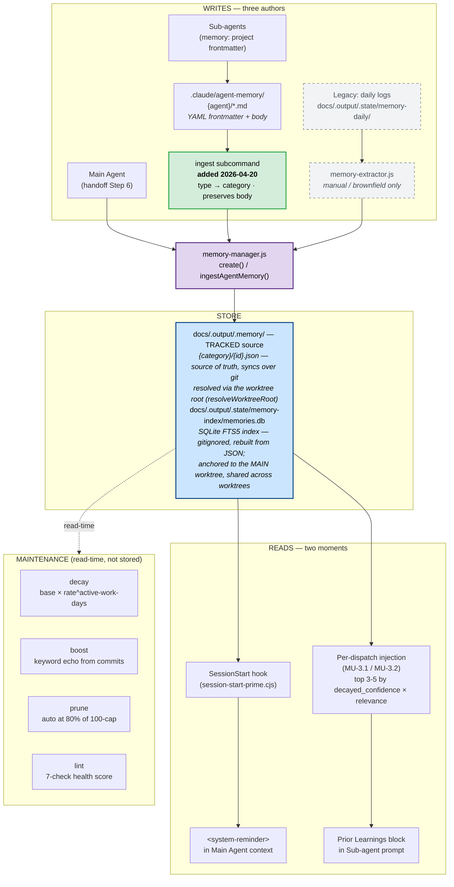

# Memory Flow

Quick visual reference for how memories move through the system — writes, reads, and maintenance. Companion to [`../concepts/memory.md`](../concepts/memory.md) (narrative explanation) and [`system-map.md`](system-map.md) (full inventory).

> The diagram below is Mermaid. It renders natively on GitHub, in VS Code via the built-in Markdown preview, and in most modern Markdown viewers. In the Claude Code TUI it appears as source — open the file on GitHub or in an editor preview to see it rendered.

## The flow

## Write paths — three authors, one store

| Author | Trigger | Destination | Notes |
|---|---|---|---|
| **Main Agent** | End of every `/do`, `/run-todo` wave, `/run-tests`, `/todo`, `/end` — via `session-handoff` skill Step 6 | `memory-manager.js create` → JSON + FTS5 | Zero ongoing LLM cost; Main Agent already holds full context when writing the handoff. 0–3 memories per session is normal; zero is common. |
| **Sub-agents** | Native Claude Code `memory: project` frontmatter — agent decides a discovery is reusable | `.claude/agent-memory/{agent}/*.md` | Richer markdown-native format (code blocks, multi-paragraph). Does NOT auto-reach the JSON store. |
| **Bridge — `ingest`** | `node memory-manager.js ingest <path>` (manual, on-demand) | Walks `.md` files → frontmatter parse → `createMemory` → JSON + FTS5 | Lifts sub-agent content into the searchable store. Preserves full body. Dedups by (category, id). |
| **Legacy — extractor** | `node memory-manager.js extract` (manual, brownfield) | Reads daily logs → Haiku extraction → JSON | Retired from in-process after MU (commit `f51944e`). Kept for backfill from historical docs. |

## Read paths — two moments, one query engine

| Moment | Mechanism | Who sees it |
|---|---|---|
| **SessionStart** | `session-start-prime.cjs` hook injects top memories at cold start | Main Agent's opening context (as system-reminder) |
| **Per-dispatch** | Before spawning a sub-agent in `/do` Path B or `/run-todo` Wave, Main Agent runs FTS5 search on story keywords, reads top 3–5 JSON payloads, inserts as **Prior Learnings block** | The dispatched sub-agent's prompt |

**Skip condition:** if search returns zero results OR all results have decayed_confidence < 0.3, the Prior Learnings block is omitted entirely (no "no memories found" placeholder — that's noise).

## Category schema

Five categories, each with its own decay rate tuned to how fast the underlying learning goes stale:

| Category | Decay rate | Half-life (active work days) | Typical content |
|---|---|---|---|
| `decisions` | 0.98 | ~35 | ADR-style choices that constrain future direction |
| `constraints` | 0.97 | ~23 | Platform/tool/API limits that will bite future devs |
| `patterns` | 0.95 | ~14 | Repeatable techniques with demonstrated value |
| `workflows` | 0.93 | ~10 | Process sequencing that made operations safer/faster |
| `rejected-approaches` | 0.95 | ~14 | Dead ends, so future sessions don't retry them |

Per-category cap: **100 entries.** Auto-prune fires at 80% (80 entries), gated on age > 30 active days AND confidence < 0.3.

## Files of interest

- `.claude/core/memory-manager.js` — `createMemory`, `ingestAgentMemory`, `searchMemories`, `lintMemories`, `boostFromGitLog`
- `.claude/hooks/session-start-prime.cjs` — the cold-start injection path
- `.claude/skills/session-handoff/SKILL.md` Step 6 — the contract Main Agent follows when deciding what to write
- `.claude/agents/*.md` — `memory: project` frontmatter on the native sub-agent write path
- `docs/.output/findings/reviews/2026-04-20-adr-memory-unification.md` — the MU ADR that retired auto-extraction and wired per-dispatch injection
- `docs/.output/findings/research/memory-parity-findings.md` — why the `ingest` bridge exists (2026-04-20)
